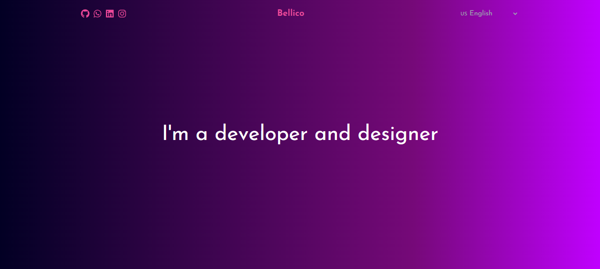

Welcome to my personal website! As I progress, I continue to enhance this space. Here, I showcase my portfolio of projects and share a bit about myself. Explore  [My Portfolio](https://bellico-portfolio.vercel.app/). 

Developed with React, Next.js, and Tailwind CSS, and hosted on Vercel.

## StackAndUses

- [x] Front-end || ReactJs, CSS, HTML, NextJs, TailwindCSS, JavaScript, TypeScript, Radix, Vite, Framer Motion.

- [x] Design || Figma, Canvas.

- [x] Documentation || Storybook.

- [x] Back-end || Node.

- [x] Database || MongoDB, MySQL.

- [x] Infrastruture ||  Supabase.

- [x] Version Control || Git, GitHub.

# Steps

- [x] Switch Languages BR/USA // after mvp

- [x] AboutMe

- [x] Rework in SelectedWorks

- [x] 404 page

- [ ] API Spotify // after mvp

- [x] API ContactMe 

- [x] Favicon

- [x] Responsive website // after mvp